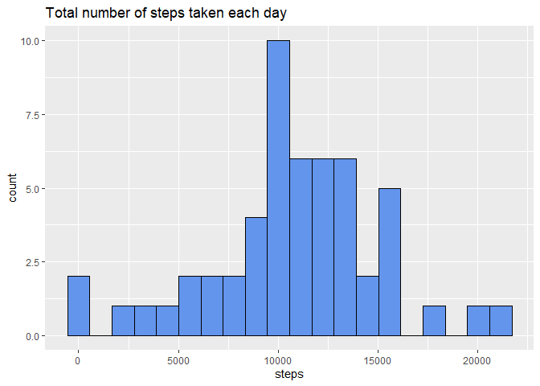
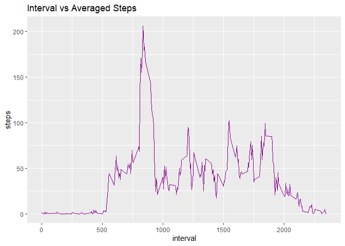
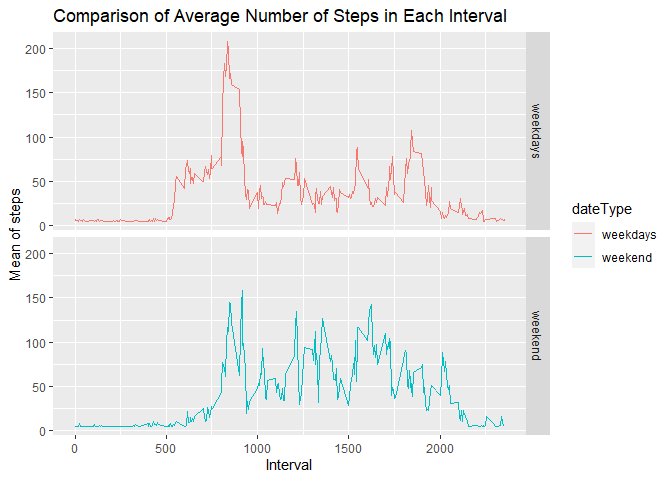

## Loading and preprocessing the data
####   1. Read the base zip file "activity.zip" that contains the data


```r
dataInput_file <- "activity.zip"
if (!file.exists(dataInput_file)) {
  data_URL <- "https://d396qusza40orc.cloudfront.net/repdata%2Fdata%2Factivity.zip"
  download.file(data_URL, destfile = dataInput_file)
  unzip (zipfile = dataInput_file)
  
}
activityData <- read.csv("activity.csv")
```


# Loading Libraries

```r
library(ggplot2)
library(data.table)
library(kableExtra)
library(lubridate)
library(scales)
library(Hmisc)
library(dplyr)
```


```r
Sys.setlocale("LC_TIME", "English")
```

```
## [1] "English_United States.1252"
```

```r
head(activityData)
```

```
##   steps       date interval
## 1    NA 2012-10-01        0
## 2    NA 2012-10-01        5
## 3    NA 2012-10-01       10
## 4    NA 2012-10-01       15
## 5    NA 2012-10-01       20
## 6    NA 2012-10-01       25
```
##### 2. Transforming Interval Data


```r
activityData <- mutate(activityData, hour=interval%/%100, minutes=interval%%100, date=factor(as.Date(date)))
activityData$elapsed <- activityData$hour * 60 + activityData$minute
activityData$timeInterval <- as.factor(sprintf("%02d:%02d", activityData$hour, activityData$minutes))
```

-----

## What is mean total number of steps taken per day?

#### 1.  The total number of steps taken per day


```r
stepsByDay <- aggregate(steps~date, activityData, sum, na.exclude=TRUE)
```


```
##          date steps
## 1  2012-10-02   127
## 2  2012-10-03 11353
## 3  2012-10-04 12117
## 4  2012-10-05 13295
## 5  2012-10-06 15421
## 6  2012-10-07 11016
## 7  2012-10-09 12812
## 8  2012-10-10  9901
## 9  2012-10-11 10305
## 10 2012-10-12 17383
## 11 2012-10-13 12427
## 12 2012-10-14 15099
## 13 2012-10-15 10140
## 14 2012-10-16 15085
## 15 2012-10-17 13453
## 16 2012-10-18 10057
## 17 2012-10-19 11830
## 18 2012-10-20 10396
## 19 2012-10-21  8822
## 20 2012-10-22 13461
## 21 2012-10-23  8919
## 22 2012-10-24  8356
## 23 2012-10-25  2493
## 24 2012-10-26  6779
## 25 2012-10-27 10120
## 26 2012-10-28 11459
## 27 2012-10-29  5019
## 28 2012-10-30  9820
## 29 2012-10-31 15415
## 30 2012-11-02 10601
## 31 2012-11-03 10572
## 32 2012-11-05 10440
## 33 2012-11-06  8335
## 34 2012-11-07 12884
## 35 2012-11-08  3220
## 36 2012-11-11 12609
## 37 2012-11-12 10766
## 38 2012-11-13  7337
## 39 2012-11-15    42
## 40 2012-11-16  5442
## 41 2012-11-17 14340
## 42 2012-11-18 15111
## 43 2012-11-19  8842
## 44 2012-11-20  4473
## 45 2012-11-21 12788
## 46 2012-11-22 20428
## 47 2012-11-23 21195
## 48 2012-11-24 14479
## 49 2012-11-25 11835
## 50 2012-11-26 11163
## 51 2012-11-27 13647
## 52 2012-11-28 10184
## 53 2012-11-29  7048
```


##### 2. Histogram of the total number of steps taken each day


```r
step_hist <- ggplot(stepsByDay, aes(steps)) +
    geom_histogram(bins=20, col="black", fill="cornflowerblue") +
    ggtitle("Total number of steps taken each day")
print(step_hist)
```

<!-- -->


##### 3. Mean and median total number of steps taken per day


```r
stepsByDayMean <- round(mean(stepsByDay$steps, na.rm=TRUE), 2)
stepsByDayMedian <- round(median(stepsByDay$steps, na.rm=TRUE), 2)
```
* Mean: 1.076719\times 10^{4} 
* Median: 1.0766\times 10^{4}

-----

## What is the average daily activity pattern?


```r
averageStepsPerTimeBlock <- aggregate(steps~interval, activityData, mean, na.exclude=TRUE)
```

##### 1. Time series plot


```r
interval_hist <- ggplot(averageStepsPerTimeBlock, aes(interval, steps)) +
    geom_line(col="darkmagenta") +
    ggtitle("Interval vs Averaged Steps")
print(interval_hist)
```

<!-- -->
##### 2. Which 5-minute interval, on average across all the days in the dataset, contains the maximum number of steps?


```r
mostSteps <- which.max(averageStepsPerTimeBlock$meanSteps)
timeMostSteps <-  gsub("([0-9]{1,2})([0-9]{2})", "\\1:\\2", averageStepsPerTimeBlock[mostSteps,'interval'])
```

* Most Steps at: 

----


## Imputing missing values

##### 1. Calculate and report the total number of missing values in the dataset. 


```r
numMissingValues <- length(which(is.na(activityData$steps)))
```


```
## [1] 2304
```

##### 2. Devise a strategy for filling in all of the missing values in the dataset. 

From the data analysis, we realize that the missing values are only in the "steps" column. Therefore, our development aims to focus only on that column.
We will use the mean value for each interval and that will be replaced by the missing values in the "steps" column.

```r
data_new <- activityData
count <- 0
for(i in 1:nrow(data_new)) {
    if(is.na(data_new$steps[i])) {
        data_new$steps[i] <- round(averageStepsPerTimeBlock$steps[which(averageStepsPerTimeBlock$interval == data_new$interval[i])])
    }
}
```
##### 3. Create a new dataset that is equal to the original dataset but with the missing data filled in.


```r
activityDataImputed <- activityData
activityDataImputed$steps <- impute(activityData$steps, fun=mean)
```


##### 4. Histogram of the total number of steps taken each day 


```r
new_num_steps <- aggregate(steps~date, data_new, sum)
new_steps_hist <- ggplot(new_num_steps, aes(steps)) +
    geom_histogram(bins=20, col="black", fill="darkmagenta") +
    ggtitle("Total number of steps taken each day (NA's filled)")
print(new_steps_hist)
```

<!-- -->


 

##### ... and Calculate and report the mean and median total number of steps taken per day. 


```r
new_steps_mean <- round(mean(new_num_steps$steps, na.rm=TRUE), 2)
new_steps_median <- round(median(new_num_steps$steps, na.rm=TRUE),2)
```


```r
comparison_dt <- data.table(c("original", "filled"), c(stepsByDayMean, new_steps_mean), c(stepsByDayMedian, new_steps_median))
colnames(comparison_dt) <- c("data", "mean", "median")

kbl(comparison_dt, align="c", caption="Table1: Statistical comparison of NA's and filled data for total number of steps taken per day" ,booktabs=TRUE) %>% 
    kable_styling(latex_options = c("striped", "hold_position"))    
```

<table class="table" style="margin-left: auto; margin-right: auto;">
<caption>Table1: Statistical comparison of NA's and filled data for total number of steps taken per day</caption>
 <thead>
  <tr>
   <th style="text-align:center;"> data </th>
   <th style="text-align:center;"> mean </th>
   <th style="text-align:center;"> median </th>
  </tr>
 </thead>
<tbody>
  <tr>
   <td style="text-align:center;"> original </td>
   <td style="text-align:center;"> 10767.19 </td>
   <td style="text-align:center;"> 10766 </td>
  </tr>
  <tr>
   <td style="text-align:center;"> filled </td>
   <td style="text-align:center;"> 10765.64 </td>
   <td style="text-align:center;"> 10762 </td>
  </tr>
</tbody>
</table>


----
From Table 1, it can be observed that there are differences in the values of **mean** and **median** for both original and filled data. The differences in **mean** values are 1.55, whereas the differences in **median** values are 4. Imputing missing data on the estimates of the total daily number of steps may affect the **mean** and **median** values based on the strategy that was used to.


### Are there differences in activity patterns between weekdays and weekends?
##### 1. Creating new factor for two series (weekdays, weekend)


```r
activityDataImputed$dateType <-  ifelse(as.POSIXlt(activityDataImputed$date)$wday %in% c(0,6), 'weekend', 'weekdays')
```

##### 2. Ploting comparative series


```r
averagedActivityDataImputed <- aggregate(steps ~ interval + dateType, data=activityDataImputed, mean)
ggplot(averagedActivityDataImputed, aes(interval, steps, color=dateType)) + 
    geom_line() + 
    facet_grid(dateType ~ .) +
    xlab("Interval") + 
    ylab("Mean of steps") +
    ggtitle("Comparison of Average Number of Steps in Each Interval")
```

<!-- -->
