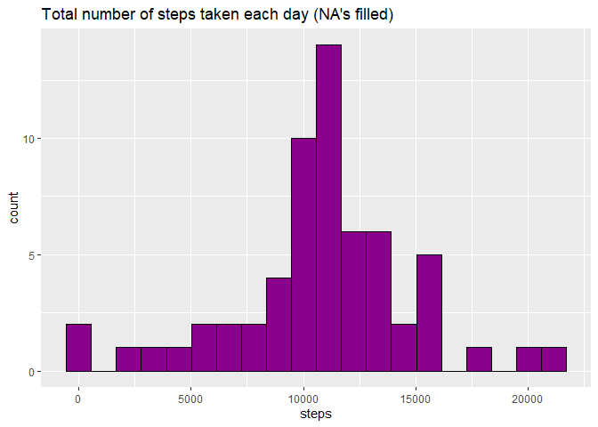

## Loading and preprocessing the data
####   1. Read the base zip file "activity.zip" that contains the data
#####     This first line will likely take a few seconds. Be patient!


```r
dataInput_file <- "activity.zip"
if (!file.exists(dataInput_file)) {
  data_URL <- "https://d396qusza40orc.cloudfront.net/repdata%2Fdata%2Factivity.zip"
  download.file(data_URL, destfile = dataInput_file)
  unzip (zipfile = dataInput_file)
  
}
activityData <- read.csv('activity.csv')

summary(activityData)
```

```
##      steps            date              interval     
##  Min.   :  0.00   Length:17568       Min.   :   0.0  
##  1st Qu.:  0.00   Class :character   1st Qu.: 588.8  
##  Median :  0.00   Mode  :character   Median :1177.5  
##  Mean   : 37.38                      Mean   :1177.5  
##  3rd Qu.: 12.00                      3rd Qu.:1766.2  
##  Max.   :806.00                      Max.   :2355.0  
##  NA's   :2304
```


##### 2. Transforming Interval Data


```r
#activityData$interval <- strptime(gsub("([0-9]{1,2})([0-9]{2})", "\\1:\\2", activityData$interval), format='%H:%M')
```

-----

## What is mean total number of steps taken per day?

#### 1.  The total number of steps taken per day


```r
stepsByDay <- tapply(activityData$steps, activityData$date, sum, na.rm=TRUE)
```


##### 2. Histogram of the total number of steps taken each day


```r
qplot(stepsByDay, xlab='Total steps per day', ylab='Frequency using binwith 500', binwidth=500)
```

<!-- -->


##### 3. Mean and median total number of steps taken per day


```r
stepsByDayMean <- mean(stepsByDay)
stepsByDayMedian <- median(stepsByDay)
```
* Mean: 9354.2295082 
* Median: 10395

-----

## What is the average daily activity pattern?


```r
averageStepsPerTimeBlock <- aggregate(x=list(meanSteps=activityData$steps), by=list(interval=activityData$interval), FUN=mean, na.rm=TRUE)
```

##### 1. Time series plot


```r
ggplot(data=averageStepsPerTimeBlock, aes(x=interval, y=meanSteps)) +
    geom_line() +
    xlab("5-minute interval") +
    ylab("average number of steps taken") 
```

<!-- -->
##### 2. The 5-minute interval on average across all the days in the dataset that contains the maximum number of steps?


```r
mostSteps <- which.max(averageStepsPerTimeBlock$meanSteps)
timeMostSteps <-  gsub("([0-9]{1,2})([0-9]{2})", "\\1:\\2", averageStepsPerTimeBlock[mostSteps,'interval'])
```

* Most Steps at: 8:35

----


## Imputing missing values

##### 1. The total number of missing values in the dataset 


```r
numMissingValues <- length(which(is.na(activityData$steps)))
```


```
## [1] 2304
```

##### 2. Devise a strategy for filling in all of the missing values in the dataset.
##### 3. Create a new dataset that is equal to the original dataset but with the missing data filled in.


```r
activityDataImputed <- activityData
activityDataImputed$steps <- impute(activityData$steps, fun=mean)
```


##### 4. Histogram of the total number of steps taken each day 


```r
stepsByDayImputed <- tapply(activityDataImputed$steps, activityDataImputed$date, sum)
qplot(stepsByDayImputed, xlab='Total steps per day (Imputed)', ylab='Frequency using binwith 500', binwidth=500)
```

<!-- -->


 

##### ... and Calculate and report the mean and median total number of steps taken per day. 


```r
stepsByDayMeanImputed <- mean(stepsByDayImputed)
stepsByDayMedianImputed <- median(stepsByDayImputed)
```
* Mean (Imputed): 1.0766189\times 10^{4}
* Median (Imputed):  1.0766189\times 10^{4}


----


## Are there differences in activity patterns between weekdays and weekends?
##### 1. Creating new factor for two series (weekdays, weekend)


```r
activityDataImputed$dateType <-  ifelse(as.POSIXlt(activityDataImputed$date)$wday %in% c(0,6), 'weekend', 'weekdays')
```

##### 2. Ploting comparative series


```r
averagedActivityDataImputed <- aggregate(steps ~ interval + dateType, data=activityDataImputed, mean)
ggplot(averagedActivityDataImputed, aes(interval, steps, color=dateType)) + 
    geom_line() + 
    facet_grid(dateType ~ .) +
    xlab("Interval") + 
    ylab("Mean of steps") +
    ggtitle("Comparison of Average Number of Steps in Each Interval")
```

<!-- -->
